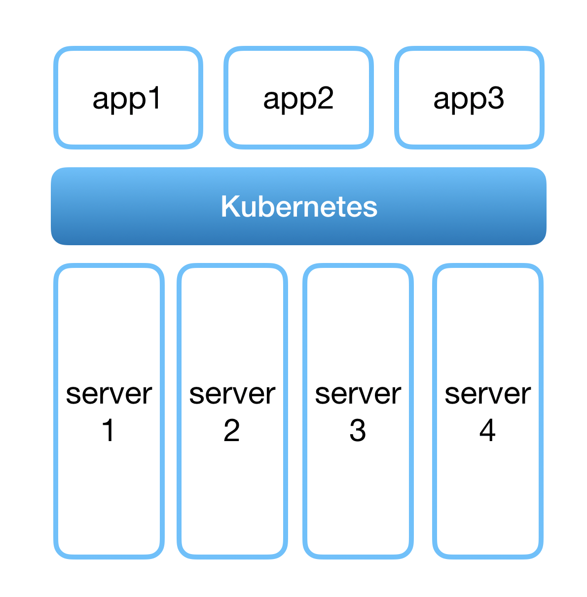
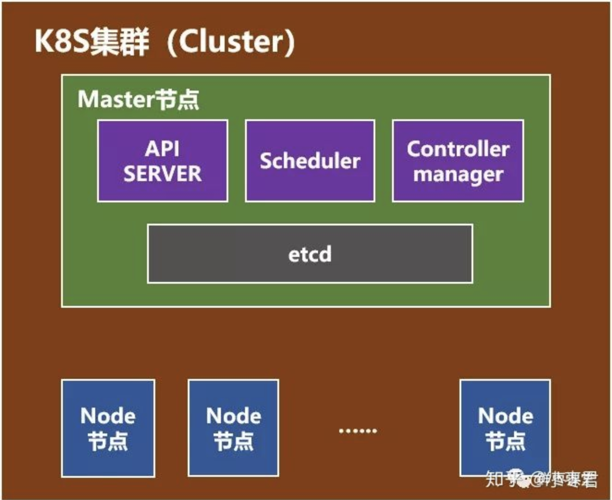
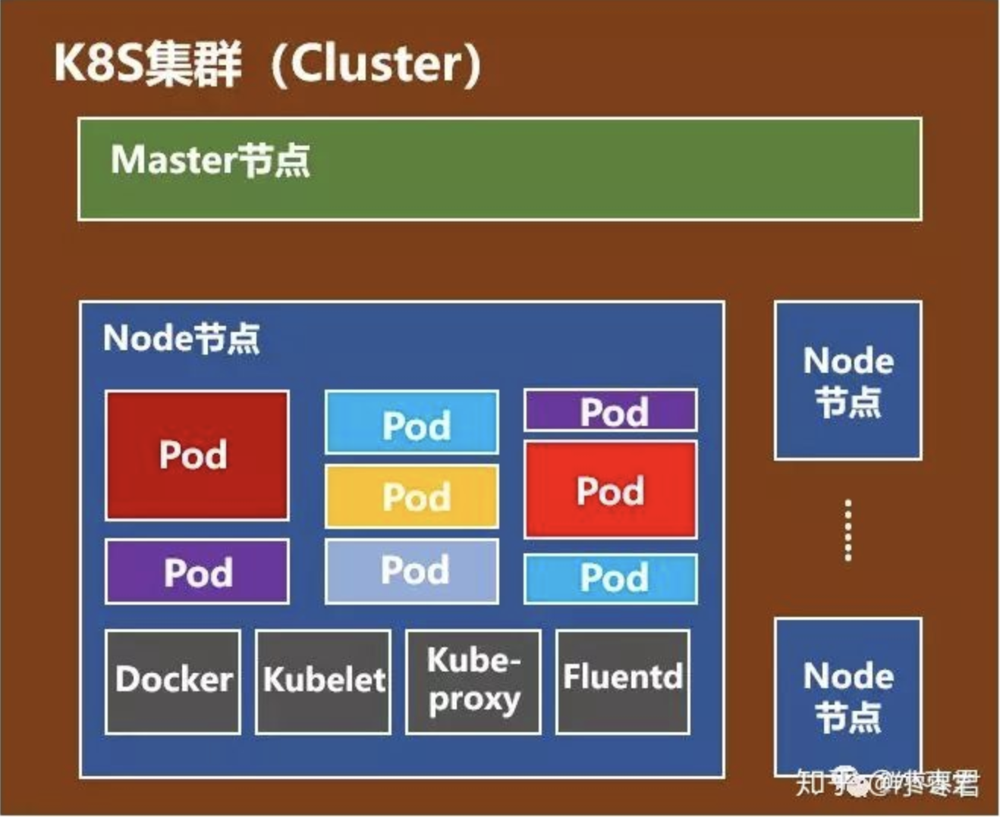

# Docker

## 什么是Docker？

Docker是一个能够把开发的应用程序自动部署到容器的开源引擎

Docker 在虚拟化的容器执行环境中增加了一个应用程序部署引擎，该引擎的目标就是提供一个轻量、快速的环境，能够运行开发者的程序，并方便高效地将程序从开发者的笔记本部署到测试环境，然后再部署到生产环境。

1. 提供一个简单、轻量的建模方式 
   * Dockerize
   * 充分利用系统资源
2. 职责的逻辑分离
   * 开发人员只需关心容器中运行的应用程序，而运维人员只需要关心如何管理容器
   * 加强开发环境与生产环境的一致性
3. 快速、高效的开发生命周期
   * 可移植性，易于构建，易于协作

## Docker核心组件

### Docker客户端和服务器

Docker是一个客户-服务器（C/S）架构的程序。Docker客户端只需想Docker服务器或守护进程发出请求，服务器或守护进程将完成所有工作并返回结果。

- 命令行工具`docker`
- RESTful API

### Docker镜像

用户基于镜像来运行自己的容器。镜像体积很小，易于分享、存储和更新。

* 可以把镜像当作容器的”源代码“
* 镜像是Docker生命周期中的构建/打包阶段
* 它是基于Union文件系统的一种层式的结构，由一系列指令一步一步构建出来

### Registry

Docker用Registry来保存用户构建的镜像

### Docker容器

Docker可以帮你构建和部署容器，你只需要把自己的应用程序或服务打包放进容器即可。容器是Docker生命周期中的启动/执行阶段。

Docker容器就是：

* 一个镜像格式
* 一系列标准的操作
* 一个执行的环境

在Docker的设计中，容器相当于一个标准集装箱：

* 每个容器都包含一个软件镜像，也就是容器的“货物”
* Docker不关心集装箱里的“货物”是什么，也不关心你要把容器运到哪里去

# Kubernetes

将Docker应用于具体的业务实现，其实在编排、管理和调度等各个方面还是存在困难的。于是，人们需要一套管理系统对Docker及容器进行更高级更灵活的管理。kubernetes就是一个基于容器的集群管理平台，简称k8s。

> *Kubernetes 是一个生产级的开源平台，用于协调计算机集群内部和跨计算机集群的应用程序容器的分发(调度)和运行。*

## Kubernetes 集群

容器化的应用程序可以部署到集群上，而不必专门将其绑定在某个计算机上。Kubernetes 在一个集群上以更有效的方式自动分发和调度容器应用程序。

Kubernetes 集群由两种类型的资源组成:

- **Master** 是集群的调度节点
- **Nodes** 是应用程序实际运行的工作节点

master 负责管理集群，协调集群中的所有活动，例如调度应用程序、维护应用程序的所需状态、扩展应用程序和滚动更新。

nodes 是k8s集群中的工作机器，可以是物理机或者虚拟机，用于托管正在运行的应用程序。

### pod

Pod是Kubernetes最基本的操作单元。它是一个环境(包括容器、存储、网络ip:port、容器配置)。其中可以运行1个或多个container（docker或其他容器）